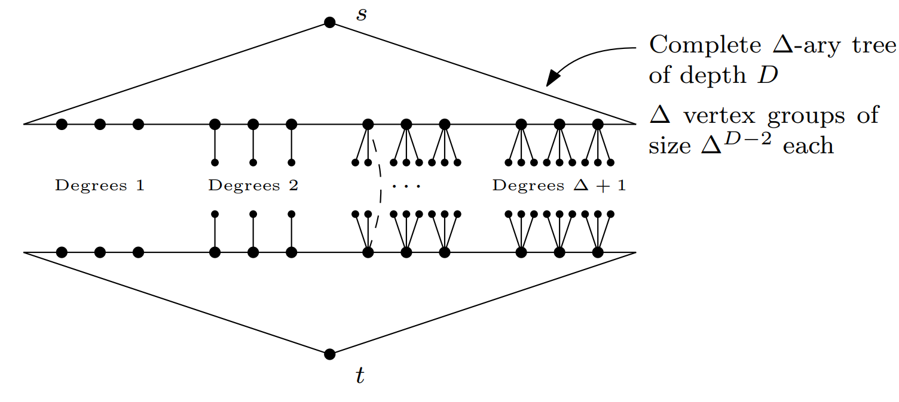

## Algorithm 2: The Equal-Work Strategy


- Unlike heuristics that guess direction, Algorithm 2 enforces equilibrium.
- It strictly alternates relaxations, ensuring the forward set $|E_s|$ and backward set $|E_t|$ grow at identical rates.

---

## The State Variables


- $u_s$: Current active node in Forward Search.
- $u_t$: Current active node in Backward Search.
- $\mu$: Length of the shortest path found so far.


---

## The Stopping Condition

- $d(s,u_s) + d(u_t,t) \ge \mu$.
- We stop only when the sum of the search radii exceeds the length of the best path found so far.
- This guarantees no shorter path can exist in the unexplored parts.

---

## Theorem 3: Instance Optimality
:::{.callout-note icon="false"}
## Theorem 3
- Algorithm 2 is instance-optimal under query complexity for the shortest st-path problem in graphs with positive weights[cite: 80, 81].
- For any graph $G$ and any correct competitor algorithm $A'$ (Prob$[Correctness] \ge 0.9$): 
  $$T_{Alg2}(G) \le C \cdot T_{A'}(G)$$.
:::

---

## Correctness:
- Assume the algorithm stops with value $\mu$, but a path $P'$ of length $\mu' < \mu$ exists.
- Define $d_s := d(s,u_s)$ and $d_t := d(u_t,t)$.
- Choose edge $uv$ on $P'$ s.t. 
    $$u = \text{argmax} \{d(s,u) \mid d(s,u) < d_s \}$$.

---

## Properties of u and v
- $d(s,u) < d_s \Rightarrow u$ is closed in the foward pass
- $d(s,u) < d_s \Rightarrow d_s \le d(s,v)$
- Therefore: $$d(v,t) = \mu' - d(s,v)  < \mu - d_s \le d_t$$
```{dot}
graph {
    rankdir=LR;
    node [shape=circle];

    label="P'";
    labelloc="t"; // Places the label at the top

    s [label="s", style=filled, fillcolor=lightblue];
    u [label="u", style=filled, fillcolor=yellow];
    v [label="v", style=filled, fillcolor=yellow];
    t [label="t", style=filled, fillcolor=orange];
    
    s -- u [style="dotted", penwidth=2];
    u -- v [penwidth=2, label="uv"];
    v -- t [style="dotted", penwidth=2];
}
```
---

## The Contradiction
- Since $u$ is closed forward and $v$ is closed backward, edge $uv$ was explored.
- Algorithm Update Rule: $\mu \leftarrow \min(\mu, d(s,u) + l(uv) + d(v,t))$.
- Result: The algorithm would have updated $\mu$ to be $\le \mu'$, in contradiction to $\mu > \mu'$.

---

## Optimality Proof

- Define set $E_s$ (Forward Explored Edges) and set $E_t$ (Backward Explored Edges).
- $|E_t| \le |E_s| \le |E_t| + 1$.
- Total Complexity $\approx 2 \cdot |E_s|$.

---

## The Competitor Assumption

- Suppose there exists a correct algorithm $A'$ that explores significantly less edges.
- $E[\text{edges explored by } A'] \le \frac{|E_t|}{4}$.
- Goal: We will prove that $A'$ must be incorrect with probability $\ge 1/2$.

---

## The Probabilistic Reduction
- By Linearity of Expectation, there must exist edges $u_1v_1 = e_1 \in E_s$ and $u_2v_2 = e_2 \in E_t$ that $A'$ s.t:
- Prob $[A' \text{ queries } e_1] \le 1/4$. 
- Prob $[A' \text{ queries } e_2] \le 1/4$.
- W.O.L.G, in the undirected case:
$$d(s,u_{1}) \le d(s,v_{1}) \text{ and } d(v_{2},t) \le d(u_{2},t)$$

---

## Proving $d(s,t) > d(s,u_1) + d(v_2,t)$
::: {.callout-note icon="false"}
### Claim
$$d(s,u_1) \le d(s,u_s)$$
$$d(v_2,t) \le d(v_2,u_t)$$
:::

- Consider the point in time right before the condition $\hat d(s, u_s) + \hat d(u_t
, t) ≥ \mu$ starts being true. 
- At that point, $E_s, E_t$ are set, and therefore $e_1$ has been explored.

---

## $u1$ and $v2$ are closed

- In the directed case: $e_1$ being explored implies $u_1$ is closed in the forward search and therefore $d(s,u_1) \le d(s,u_s)$.
- In the undirected case: one of $u_1, v_1$ is closed:
- If $v_1$ is closed, it must hold that $d(s,u_1) \le d(s,u_s)$. 
- From the assumption $d(s,u_1) \le d(s,v_1)$, therefore $d(s,u_1) \le d(s,u_s)$

---

## The Gap

- Stopping Threshold: $d(s,u_s) + d(u_t,t) < \mu$.
- $u_1$ and $v_2$ were closed before $u_s$ and $u_t$.
- Therefore: $d(s,u_1) + d(v_2,t) \le d(s,u_s) + d(u_t,t)$.
- Result: $d(s,u_1) + d(v_2,t) < \mu$.

---

## Defining Delta
- We define the "slack" in the system: $\delta = d(s,t) - d(s,u_1) - d(v_2,t)$.
- From the previous slide, we know $\delta > 0$.

---

## Constructing the Adversarial Graph G'
- Construct $G'$ by replacing $e_1, e_2$ with $u_1v_2, u_2v_1$ with weights $0 < \delta' < \delta$ and an arbitrary weight.
- With probability $\ge 1/2$, $A'$ cannot distinguish $G$ and $G'$.
- We'll show that $d_{G'}(s,t) < d_G(s,t)$.

```{dot}
graph  {
    rankdir=LR
    node [shape=circle];
        
    s [label="s", style=filled, fillcolor=lightblue];
    t [label="t", style=filled, fillcolor=lightblue];
    u1 [label="u1"];
    v1 [label="v1"];
    u2 [label="u2"];
    v2 [label="v2"];

    s -- u1 [style="dotted", label="?"];
    v2 -- t [style="dotted", label="?"];
    u1 -- v1 [label="e1", color=red, penwidth=2];
    u2 -- v2 [label="e2", color=red, penwidth=2];
    
    u1 -- v2 [color=green, penwidth=2, label=" δ′"];
    v1 -- u2 [color=green, penwidth=1];
    
}
```

---

## Distance Analysis in G'

::: {.callout-note icon="false"}
### Claim
$$d_{G'}(s,u_1) \le d_{G}(s,u_1)$$
$$d_{G'}(v_2,t) \leq d_{G}(v_2,t)$$
:::

- We will only show the undirected case as the directed is easier.
- Let $P$ be a shortest $su_1$-path in $G$.
- We show that $P$ does not use either $e_1$ or $e_2$.

---

## Distance Analysis in G' 
- $P$ cannot use $e_1$ since $d(s,v_1) \ge d(s,u_1)$.
- $P$ cannot use $e_2$, otherwise: 
  - $d(s,v_2) \ge d(s,u_1)$
  - and there would be a st-Path of length:
              $$d(s, v_2) + d(v_2, t) \le d(s, u_1) + d(v_1, t) < d(s,t)$$

---

## Distance Analysis in G'
- $d_{G'}(s,t) \le d_{G'}(s,u_1) + l(u_1,v_2) + d_{G'}(v_2,t)$.
- $d_{G'}(s,t) \le d_G(s,u_1) + \delta' + d_G(v_2,t)$.
- Since $\delta' < \delta$: $d_{G'}(s,t) < d_G(s,u_1) + \delta + d_G(v_2,t) = d_G(s,t)$.
- therefore: $d_{G'}(s,t) < d_G(s,t)$.

---

## The Contradiction
- $A'$ Output($G$) = $A'$ Output($G'$) (With prob $\ge 1/2$).
- True Distance ($G$) $\neq$ True Distance ($G'$).
- Algorithm $A'$ returns the same answer for two graphs with different shortest paths. 
- It is incorrect with probability $\ge 1/2$.

---

## Final note

- we looked at the case where $e_1 \neq e_2$.
- the other case is similar and results in a probability $\ge 1/4$ for a mistake.

---

## Conclusion: The Limit of Efficiency
- We assumed a competitor $A'$ could be 4x faster. 
- We proved such an algorithm fails on adversarial inputs constructed from its own blind spots.
- Therefore, Bidirectional Dijkstra (Algorithm 2) is instance-optimal. Q.E.D..

## Unweighted Graphs
- Essentially Bidirectional BFS
- No heap is needed
    - Query complexity equals time complexity
- $d=\hat{d}$

## Instance Optimality
- Denote the maximum degree of the graph as $\Delta$.

:::{.callout-note icon="false"}
## Theorem 4
The bidirectional BFS algorithm for the shortest $st$-path problem in unweighted graphs is instance-optimal, under both query and time complexity, up to the factor of $O(\Delta)$.
:::

## Where does the previous proof fail?
```{dot}
graph  {
    rankdir=LR
    node [shape=circle];

    label="0< δ' < δ = d(s,t) - d(s,u1) - d(v2,t)";
    labelloc = "t";
        
    s [label="s", style=filled, fillcolor=lightblue];
    t [label="t", style=filled, fillcolor=lightblue];
    
    u1 [label="u1"];
    v1 [label="v1"];
    u2 [label="u2"];
    v2 [label="v2"];

    v1--v2 [style="invisible"];
    u1--u2 [style="invisible"];
    s -- u1 [style="dotted"];
    v2 -- t [style="dotted"];
    u1 -- v1 [label="e1", color=red, penwidth=2];
    u2 -- v2 [label="e2", color=red, penwidth=2];
    u1 -- v2 [label="δ'", color=green, penwidth=2];
    u2 -- v1 [color=green, penwidth=1];
    
    {rank=same; u1; u2}
    {rank=same; v1; v2}
}
```
- We would like to have $\delta > 1$

## Proof of Thm. 4
- We prove the undirected case.
- $u_0,v_0$ are the nodes that define $\mu=d(s,t)$
$$d(s,u_0) + l(u_0,v_0) + d(v_0,t) = \mu$$
- WLOG it happened in the forward search.
- $v_0$ was opened by $w_0$ in the backward run.
- $x = d(s,u_0), y = d(w_0,t)$
- $\mu = x + y + 2$

## Proof of Thm. 4
$$E_s = \{uv \in E \mid d(s,u) \le x\}$$
$$E_t = \{uv \in E \mid d(u,t) \le y\}$$

```{dot}
graph  {
    rankdir=LR
    node [shape=circle];
        
    s [label="s", style=filled, fillcolor=lightblue];
    t [label="t", style=filled, fillcolor=lightblue];
    u0 [label="u0"];
    v0 [label="v0"];
    w0 [label="w0"];

    s -- u0 [style="dotted", label="x"];
    w0 -- t [style="dotted", label="y"];
    u0 -- v0;
    v0 -- w0;    
}
```

## Proof of Thm. 4
- Let $A'$ be an algorithm that explores at most $min\{E_s, E_t\}/4$ edges in expectation.
- There exist $e_1=u_1v_1 \in E_s, e_2=u_2v_2 \in E_t$ that are not queried by $A'$ with prob. $\ge 1/2$.
- WLOG, $d(s,u_1) \le d(s,v_1)$ and $d(v_2,t) \le d(u_2,t)$.

## Proof of Thm. 4
- $e_1 \neq e_2$
```{dot}
graph  {
    label="μ = x + y + 2";
    labelloc = "t";
    rankdir=LR
    node [shape=circle];
        
    s [label="s", style=filled, fillcolor=lightblue];
    t [label="t", style=filled, fillcolor=lightblue];
    u1 [label="u1"];
    v1 [label="v1"];
    u2 [label="u2"];
    v2 [label="v2"];

    s -- u1 [style="dotted", label="<=x"];
    v2 -- t [style="dotted", label="<=y"];
    u1 -- v1 [label="e1", color=red, penwidth=2];
    u2 -- v2 [label="e2", color=red, penwidth=2];
    v1 -- u2 [style="invisible"]
}
```

## Proof of Thm. 4
- Construct $G'$ by replacing $e_1, e_2$ with $u_1v_2, u_2v_1$.
- With prob. $\ge 1/2$, $A'$ cannot distinguish $G$ and $G'$.
- We show that $d_{G'}(s,t) < d_G(s,t)$.
```{dot}
graph  {
    rankdir=LR
    node [shape=circle];
        
    s [label="s", style=filled, fillcolor=lightblue];
    t [label="t", style=filled, fillcolor=lightblue];
    u1 [label="u1"];
    v1 [label="v1"];
    u2 [label="u2"];
    v2 [label="v2"];

    s -- u1 [style="dotted", label="?"];
    v2 -- t [style="dotted", label="?"];
    u1 -- v1 [label="e1", color=red, penwidth=2];
    u2 -- v2 [label="e2", color=red, penwidth=2];
    
    u1 -- v2 [color=green, penwidth=2];
    v1 -- u2 [color=green, penwidth=1];
    
}
```

## Proof of Thm. 4
::: {.callout-note icon="false"}
### Claim
$$d_{G'}(s,u_1) \le d_{G}(s,u_1)$$
$$d_{G'}(v_2,t) \leq d_{G}(v_2,t)$$
:::
```{dot}
graph  {
    label="μ = x + y + 2";
    labelloc = "t";
    rankdir=LR
    node [shape=circle];
    s [label="s", style=filled, fillcolor=lightblue];
    t [label="t", style=filled, fillcolor=lightblue];
    u1 [label="u1"];
    v1 [label="v1"];
    u2 [label="u2"];
    v2 [label="v2"];

    s -- u1 [style="dotted", label="<=x"];
    v2 -- t [style="dotted", label="<=y"];
    u1 -- v1 [label="e1", color=red, penwidth=2];
    u2 -- v2 [label="e2", color=red, penwidth=2];
    
    u1 -- v2 [color=green, penwidth=2];
    v1 -- u2 [color=green, penwidth=1];
    
}
```
## Proof of Thm. 4
- We prove $d_{G'}(s,u_1) \le d_{G}(s,u_1)$.
- Let $P$ be a shortest $su_1$-path in $G$.
- We show that $P$ does not use either $e_1$ or $e_2$.
- $P$ cannot use $e_1$ since $d(s,v_1) \ge d(s,u_1)$.
- $P$ cannot use $e_2$, otherwise
$$x+y+2 = d(s,t) \le |P| + 1 + d(u_2,t) \le x+y+1$$

## Complexity Analysis
- We have shown that the query complexity of $A'$ is $\Omega(min\{|E_s|, |E_t|\})$.
- *What about the bidirectional BFS?*

## Complexity Analysis
::: {.callout-note icon="false"}
### Lemma
1. The forward search closes at most one vertex of distance $\ge x+2$ from $s$.
2. The backward search closes at most one vertex of distance $\ge y+2$ from $t$.
:::
- The forward search explores at most $|\bar{B}_{x+1}(s)| + 1 \le |E_s| + 1$ vertices.
- That is, $O(\Delta |E_s|)$ edges are explored.
- Similarly, the backward search explores at most $O(\Delta |E_t|)$ edges.
- Hence, the query complexity is $O(\Delta min\{|E_s|, |E_t|\})$.

## Proof of Lemma
::: {.callout-note icon="false"}
### Claim
1. The backward search closes $w_0$ before the forward search finishes visiting $u_0$.
2. The forward search closes $u_0$ before the backward search finishes visiting $v_0$.
:::

- Follows from the assumption that the edge $u_0v_0$ is explored by the forward search.
```{dot}
graph  {
    rankdir=LR
    node [shape=circle];
        
    s [label="s", style=filled, fillcolor=lightblue];
    t [label="t", style=filled, fillcolor=lightblue];
    u0 [label="u0"];
    v0 [label="v0"];
    w0 [label="w0"];

    s -- u0 [style="dotted", label="x"];
    w0 -- t [style="dotted", label="y"];
    u0 -- v0;
    v0 -- w0;    
}
```

## Proof of Lemma - *part 1*
- Consider the point in time where the forward search first closes a vertex $u_s$ s.t. $d(s,u_s) = x+2$.
- The forward search has finished visiting $u_0$.
- Hence, the backward search has closed $w_0$.
- Hence, $d(u_t,t) \ge d(w_0,t) = y$.
- Hence, stopping condition is satisfied and the algorithm terminates.

## Proof of Lemma - *part 2*
- Consider the point in time where the backward search first closes a vertex $u_t$ s.t. $d(t,u_t) = y+2$.
- The backward search has finished visiting $v_0$.
- Hence, the backward search has closed $u_0$.
- Hence, $d(s,u_s) \ge d(s,u_0) =x$.
- Hence, stopping condition is satisfied and the algorithm terminates.

## Can we do better?
::: {.callout-note icon="false"}
### Theorem 5
Assume the shortest $st$-path problem in unweighted graphs of degree at most $\Delta$. Then there is no algorithm that is instance optimal, under both query and time complexity, for the problem up to a factor of $o(\Delta)$.
:::
- ***Remark.*** Can be generlized to weighted graphs where the allowed weights come from a set $W$ with $min(W) > 0$.

## Proof of Thm. 5
- $G$: 2 disconnected complete $\Delta$-ary trees of depth $D$.
```{dot}
digraph {
    rankdir=LR;
    
    // Global edge setting: hide arrowheads
    edge [dir=none]; 
    node [shape=circle, label=""];

    s [label="s", style=filled, fillcolor=lightblue];
    t [label="t", style=filled, fillcolor=lightblue];

    s -> {u1, u2} [style="dotted"];
    u1 -> {u3, u4};
    u2 -> {u5, u6};

    {v3, v4} -> v1;
    {v5, v6} -> v2;
    {v1, v2} -> t [style="dotted"];

    u2 -> v2 [style="invisible"]
    u3->v3 [style="invisible"];
    u4->v4 [style="invisible"];
    u5->v5 [style="invisible"];
    u6->v6 [style="invisible"];

    {rank=source; s}
    {rank=sink; t}
    {rank=same; u1; u2}
    {rank=same; v1; v2}
    {rank=same; u3; u4; u5; u6}
    {rank=same; v3; v4; v5; v6}

}
```
## Proof of Thm. 5
- $G_i$: remove the $i$-th edges in the last level, and connect the corresponding two vertices on the penultimate layer with a new edge.
    - $d_{G_i}(s,t)=2D-1$, maximal degree is $\Delta+1$.

```{dot}
digraph {
    rankdir=LR;
    
    // Global edge setting: hide arrowheads
    edge [dir=none]; 
    node [shape=circle, label=""];

    s [label="s", style=filled, fillcolor=lightblue];
    t [label="t", style=filled, fillcolor=lightblue];

    s -> {u1, u2} [style="dotted"];
    u1 -> {u3, u4};
    u2 -> u5;

    {v3, v4} -> v1;
    v5 -> v2;
    {v1, v2} -> t [style="dotted"];

    u2 -> v2 [label="i",style="bold", color=red, penwidth=2];
    u3->v3 [style="invisible"];
    u4->v4 [style="invisible"];
    u5->v5 [style="invisible"];

    {rank=source; s}
    {rank=sink; t}
    {rank=same; u1; u2}
    {rank=same; v1; v2}
    {rank=same; u3; u4; u5}
    {rank=same; v3; v4; v5}

}
```

## Proof of Thm. 5
- Let $A$ be a randomized algorithm on inputs from $\mathcal{X}=\{G_i\}_{i=1}^{\Delta^D}$ with success probability of $c$.
- We claim that $A$ has worst case expected complexity of $\Omega(\Delta^D)$.

::: {.callout-note icon="false"}
### Yao's Minimax Principle (informal)
The expected cost of a randomized algorithm on the
worst-case input is at least the expected cost of the best
deterministic algorithm for any fixed distribution over the inputs.
:::

## Proof of Thm. 5
- Let $A$ be a deterministic algorithm that answers correctly on a fraction of $\ge c$ of the inputs from $\mathcal{X}$.
- Let $\mathcal{X}^*$ be the set of inputs on which $A$ answers correctly.
- Denote by $Q_i$ the sequence of edges queried by $A$ on input $G_i$, before it queries the $i$-th edge in the last level.
- Let $k = argmax_{i} |Q_i|$.

## Proof of Thm. 5
- For all $G_i\in \mathcal{X}^*$, denote by $Q^i_k$ the prefix of $Q_k$ before the $i$-th edge in the last level is queried.
- We have $Q^i_k = Q_i$. That is, $Q_i$'s are distinct prefixes of $Q_k$.
- Hence, the expected query complexity of $A$ (assuming uniform distribution over $\mathcal{X}$) is at least
$$\frac{1}{|\mathcal{X}|}\sum_{i\in \mathcal{X}^*} |Q_i| \ge \frac{1}{|\mathcal{X}|}\sum_{i=1}^{|\mathcal{X}^*|} i = \Omega(|\mathcal{X}|) = \Omega(\Delta^D)$$

## Proof of Thm. 5
- Fix $i$. We describe an algorithm that is correct (on all input graphs) and runs in time $O(\Delta^{D-1})$ on $G_i$.

## Attempt 1
- Explore the vertices from s and t until the penultimate layer.
    - If the input graph is not a double $\Delta$-ary tree, dispose of the run and run any correct algorithm.
- **Query only the $i$-th edge in the last level.**
    - If that edge connects the two components containing $s$ and $t$, finish.
    - Otherwise, dispose of the run and run any correct algorithm.

## Attempt 2
- How to find the hidden edge?
    - Use degrees for identification.
- $\Delta$ groups of size $\Delta^{D-2}$ each in the penultimate layer.


## Attempt 2
- Suppose the hidden edge connects vertices with degree $k$.
- Explore the vertices from s and t until the penultimate layer.
    - If the input graph is not a double $\Delta$-ary tree, dispose of the run and run any correct algorithm.
- **Explore the vertices with degree $k$ in the penultimate layer.**
    - If the hidden edge is found, finish.
    - Otherwise, dispose of the run and run any correct algorithm.
