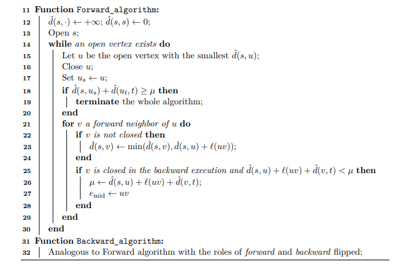
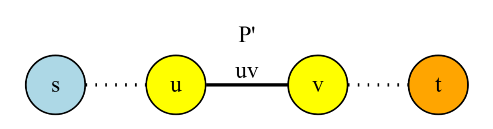

## The Status Quo: Dijkstra's Algorithm

```{mermaid}
graph LR
    S((S)) --> A1 & A2 & A3
    A1 --> B1 & B2
    A2 --> B2 & B3
    A3 --> B3 & B4
    B1 -.-> W1((...))
    B4 -.-> W2((...))
    B2 & B3 --> C1((...))
    C1 --> T(((T)))

    style S fill:#85C1E9,stroke:#333,stroke-width:2px
    style T fill:#F1948A,stroke:#333,stroke-width:2px
    style A1 fill:#EAECEE
    style A2 fill:#EAECEE
    style A3 fill:#EAECEE
    style B1 fill:#EAECEE
    style B2 fill:#EAECEE
    style B3 fill:#EAECEE
    style B4 fill:#EAECEE
```

::: incremental
-   Near-optimal $O(m + n \log n)$ time, but...
-   Struggles on huge graphs — explores too many irrelevant vertices
:::

::: notes
Dijkstra's algorithm is a textbook classic. Its time complexity is essentially optimal for general single-source shortest paths. But when the graph has millions or billions of edges, as in road networks or social graphs, it expands outward in all directions and does a lot of unnecessary work just to find one specific target.
:::

------------------------------------------------------------------------

## The Practical Solution: Bidirectional Search

```{dot}
//| fig-height: 2.5
graph {
    rankdir=LR;
    node [shape=circle, width=0.4, fontsize=10];
    graph [size="6,2"];

    s [label="s", style=filled, fillcolor="#85C1E9", penwidth=2];
    F1 [label="", style=filled, fillcolor="#EAECEE"];
    F2 [label="", style=filled, fillcolor="#EAECEE"];
    M [label="M", style=filled, fillcolor="#ABEBC6", penwidth=3, fixedsize=true, width=0.5];
    B1 [label="", style=filled, fillcolor="#EAECEE"];
    B2 [label="", style=filled, fillcolor="#EAECEE"];
    t [label="t", style=filled, fillcolor="#F1948A", penwidth=2];

    s -- F1;
    s -- F2;
    F1 -- M;
    F2 -- M;
    M -- B1;
    M -- B2;
    B1 -- t;
    B2 -- t;

    {rank=same; F1; F2}
    {rank=same; B1; B2}
}
```

::: incremental
-   Search forward from $s$ and backward from $t$; halt when they meet
-   Proposed by Dantzig (1963) and Nicholson (1966)
:::

::: notes
The intuitive fix is to search from both ends simultaneously. Forward from the source s and backward from the target t. When the two explorations "meet," we can piece together a shortest path. This idea has been around since the early 1960s and is widely used in practice — for example, in routing engines.
:::

------------------------------------------------------------------------

## Algorithm 1: The Bidirectional Template

::: {.callout-note icon="false"}
### Algorithm 1: Bidirectional Search Meta-Algorithm

**Input:** Graph $G(V, E)$, source $s$, target $t$; Selection function; Stopping condition

Initialize forward search from $s$ and backward search from $t$\
**while** *stopping condition is not satisfied* **do**\
$\quad$ Select a direction using the selection rule\
$\quad$ **if** *forward* **then** relax one edge of Dijkstra from $s$\
$\quad$ **else** relax one edge of reverse Dijkstra from $t$\
**end**\
Recover the shortest path from the two runs
:::

::: notes
This is Algorithm 1 from the paper. It's a meta-algorithm — a blueprint that every bidirectional search fits into. The two key design choices are the selection rule and the stopping condition, and the whole history of bidirectional search is about trying to get them right.
:::

------------------------------------------------------------------------

## The Key Design Questions

::: incremental
-   Algorithm 1 is a "meta-algorithm" — a blueprint, not a complete solution
-   **Which direction next?** — the Selection Rule
-   **When do we stop?** — the Stopping Condition
:::

::: notes
So the template raises two fundamental questions. First, which direction should we expand next — forward or backward? Second, when can we safely stop and be sure we've found the shortest path? Decades of research explored different answers, but none could prove their combination was the best possible. That's what this paper finally resolves.
:::

------------------------------------------------------------------------

## Historical Context

::: incremental
-   Dantzig (1963), Nicholson (1966) — early bidirectional proposals
-   Various selection rules and stopping conditions explored over decades
-   None achieved a formal proof of instance-optimality until this paper
:::

::: notes
Bidirectional search has a long history. Multiple researchers proposed different versions with different rules for which direction to expand and when to stop. But despite extensive practical success, no one had formally proved that bidirectional Dijkstra is the best you can do on every input. That's the gap this paper fills.
:::

------------------------------------------------------------------------

## Defining Instance Optimality

$$T_A(x) \le c \cdot T_{A'}(x)$$

::: incremental
-   $T_A(x)$: complexity of algorithm $A$ on input $x$
-   $T_{A'}(x)$: complexity of any correct competitor $A'$ on input $x$
-   $A$ is instance-optimal if this holds for **every** correct $A'$ and **every** $x$, for some constant $c$
:::

::: notes
Here is the formal definition. Algorithm A is instance-optimal if there exists a constant c such that for every input x and every correct competitor A-prime, the query cost of A on x is at most c times the query cost of A-prime on x. This is strictly stronger than worst-case optimality because the bound holds input-by-input, not just in the maximum.
:::

------------------------------------------------------------------------

## What Does "Correct" Mean?

::: incremental
-   An algorithm is **correct** if it outputs the right answer with probability $\ge 0.9$
-   The constant $0.9$ is arbitrary — any constant $> 1/2$ works by standard probability amplification
-   Instance-optimality applies even against **randomized** competitors
:::

::: notes
An important clarification: we allow randomized algorithms, and correctness only requires succeeding with probability at least 0.9. This threshold is not special — by repeating the algorithm and taking a majority vote, you can boost the success probability arbitrarily close to 1. The key point is that the instance-optimality result holds even against these randomized competitors.
:::

------------------------------------------------------------------------

## The Paper's Bold Claim

> **Informal Theorem 1.** In the adjacency list model, there is an instance-optimal algorithm for the shortest $st$-path problem on weighted multigraphs. On unweighted multigraphs, there is an algorithm that is instance-optimal up to a factor of $\Delta(G)$; this factor cannot be improved.

::: notes
Here is the main result of the paper. This is a very strong statement. It doesn't just say bidirectional Dijkstra is good on average or in the worst case — it says that for every single input instance, no correct algorithm can do asymptotically better. That's instance-optimality, and it's a much harder thing to prove than worst-case optimality.
:::

------------------------------------------------------------------------

## The Sublinear Query Model

::: incremental
-   The algorithm has **no global knowledge** of the graph
-   It interacts with the graph through simple **queries** to vertices and edges
:::

::: notes
Now let's set up the formal framework. The algorithm doesn't get to see the whole graph upfront. Instead, it accesses the graph through local queries. This is the sublinear query model, and it captures the reality of exploring huge graphs where you can't read the entire input.
:::

------------------------------------------------------------------------

## The Graph Model

::: incremental
-   Weighted multigraphs: real-valued weights, self-loops and parallel edges allowed
-   Stored in **incidence list** format: vertices numbered $1$ to $n$
-   Each vertex keeps a list of outgoing and incoming edges (same list if undirected)
-   Each edge stores its weight and both endpoints
:::

::: notes
Let's be precise about what kind of graphs we're talking about. These are weighted multigraphs — they can have parallel edges and self-loops, with real-valued weights. The graph is stored in incidence list format, where each vertex maintains lists of its incident edges.
:::

------------------------------------------------------------------------

## How Queries Work (Undirected)

::: incremental
-   $\text{Degree}(i)$: returns the degree of vertex $i$
-   $\text{Edge}(i, j)$: returns the $j$-th incident edge of $i$, its weight, and the other endpoint
-   For directed graphs: $\text{Indegree}$, $\text{Outdegree}$, $\text{Inedge}$, $\text{Outedge}$
-   Each query costs **one unit** — query count is our complexity measure
:::

::: notes
The algorithm interacts with the graph through two types of queries. Degree tells you how many edges a vertex has. Edge returns a specific incident edge along with its weight and the vertex on the other end. For directed graphs, we have separate queries for incoming and outgoing edges. The total number of queries is the measure of complexity we care about.
:::

------------------------------------------------------------------------

## The Competitors: Randomized Algorithms

::: incremental
-   The instance-optimality proof applies even against **randomized** algorithms
-   Complexity measured by **expected** number of queries
-   A competitor must be correct with probability $\ge 0.9$
:::

::: notes
An important detail: the lower bound isn't just against deterministic competitors. It applies to randomized algorithms too. The competitor is allowed to flip coins, and we measure its expected query count. The only requirement is that it returns the correct shortest path with probability at least 0.9.
:::

------------------------------------------------------------------------

## The Shortest $st$-Path Problem

::: incremental
-   **Input:** a (directed or undirected) multigraph $G$ with weight function $\ell : E(G) \to \mathbb{R}_{>0}$
-   Weights induce a distance function $d : V \times V \to \mathbb{R}_{> 0}$ (may differ from $d(v,u)$ in directed graphs)
-   **Task:** given vertices $s$ and $t$, return a shortest $st$-path (must specify edges, not just vertices)
-   Weights are **strictly positive** — this is crucial (non-negative case discussed in Section 5.1)
:::

::: notes
Let's define the problem precisely. We have a multigraph with strictly positive edge weights. The weights induce shortest-path distances between all pairs of vertices. Given s and t, we need to return an actual shortest path — and in multigraphs, we must specify which edges, not just the sequence of vertices. The strict positivity of weights is important and differs from the non-negative case.
:::

------------------------------------------------------------------------

## Dijkstra's Algorithm: Key Terminology

::: incremental
-   $\hat{d}(s, w)$: tentative distance — shortest $sw$-path found so far
-   Vertex states: **unvisited** → **open** → **closed**
-   Each step: close the nearest open vertex $u$, relax all edges leaving it
:::

::: notes
Let's recall Dijkstra's algorithm and fix the terminology. Each vertex starts unvisited, becomes open when first discovered, and is closed once we process it. We maintain tentative distances, and in each step we close the nearest open vertex and relax its outgoing edges. Once closed, the tentative distance is final.
:::

------------------------------------------------------------------------

## Relaxation Rule

Relaxing edge $uv$:

::: incremental
-   $v$ **unvisited**: open it, set $\hat{d}(s,v) := \hat{d}(s,u) + \ell(uv)$
-   $v$ **open**: update $\hat{d}(s,v) := \min\!\big(\hat{d}(s,v),\; \hat{d}(s,u) + \ell(uv)\big)$
-   $v$ **closed**: do nothing
:::

::: notes
When we relax an edge u-v, the action depends on the state of v. If v hasn't been seen, we open it and set its tentative distance. If v is already open, we potentially improve its distance. If v is already closed, we skip it — its distance is already final.
:::

------------------------------------------------------------------------

## The Warm-Up: Theorem 2 Setup

::: incremental
-   Setting: **directed** graphs with **positive** edge weights
-   Only **outgoing** edges can be queried
-   Goal: compute the **distance** $d(s,t)$, not necessarily a path
:::

::: notes
Before tackling the full bidirectional result, the paper gives a warm-up. The setting is simpler: directed graphs where you can only explore outgoing edges. The goal is just to compute the distance from s to t, not to return the actual path. This is Theorem 2.
:::

------------------------------------------------------------------------

## Theorem 2

::: {.callout-note icon="false"}
### Theorem 2

Run Dijkstra's algorithm from $s$ and stop once we close some vertex $v$ with $\hat{d}(s, v) = \hat{d}(s, t)$ (possibly $v = t$). Then:

1.  This algorithm **correctly computes** the $st$-distance.
2.  No correct deterministic algorithm can perform **fewer queries** on $G$.
:::

::: notes
This is the formal statement. We run standard Dijkstra from s and stop as soon as we close a vertex whose tentative distance equals the tentative distance to t. The theorem says two things: first, this gives the correct answer; second, no deterministic algorithm can do better on any given input. Let's prove both parts.
:::

------------------------------------------------------------------------

## Dijkstra Example: Initial State

```{dot}
//| fig-height: 3
digraph {
    rankdir=LR;
    node [shape=circle, style=filled, width=0.5, fontsize=11];

    s [label="s\n0", fillcolor="#85C1E9"];
    a [label="a\n∞", fillcolor="#EAECEE"];
    b [label="b\n∞", fillcolor="#EAECEE"];
    c [label="c\n∞", fillcolor="#EAECEE"];
    t [label="t\n∞", fillcolor="#EAECEE"];

    s -> a [label="2"];
    s -> b [label="5"];
    a -> b [label="1"];
    a -> c [label="4"];
    b -> t [label="3"];
    c -> t [label="1"];
}
```

Green = closed, Blue = open, Gray = unvisited

::: notes
Here's a small example graph. We start with s open at distance 0, and everything else unvisited at infinity. Let's walk through a few iterations and see when Theorem 2's stopping condition kicks in.
:::

------------------------------------------------------------------------

## Dijkstra Example: Close $s$

```{dot}
//| fig-height: 3
digraph {
    rankdir=LR;
    node [shape=circle, style=filled, width=0.5, fontsize=11];

    s [label="s\n0", fillcolor="#ABEBC6", penwidth=2];
    a [label="a\n2", fillcolor="#85C1E9"];
    b [label="b\n5", fillcolor="#85C1E9"];
    c [label="c\n∞", fillcolor="#EAECEE"];
    t [label="t\n∞", fillcolor="#EAECEE"];

    s -> a [label="2", color="red", penwidth=2];
    s -> b [label="5", color="red", penwidth=2];
    a -> b [label="1"];
    a -> c [label="4"];
    b -> t [label="3"];
    c -> t [label="1"];
}
```

Close $s$ → relax edges: $\hat{d}(a)=2$, $\hat{d}(b)=5$

::: notes
We close s — it's the only open vertex. We relax its two outgoing edges. Vertex a gets tentative distance 2, vertex b gets 5. Both become open. S is now closed, shown in green.
:::

------------------------------------------------------------------------

## Dijkstra Example: Close $a$

```{dot}
//| fig-height: 3
digraph {
    rankdir=LR;
    node [shape=circle, style=filled, width=0.5, fontsize=11];

    s [label="s\n0", fillcolor="#ABEBC6"];
    a [label="a\n2", fillcolor="#ABEBC6", penwidth=2];
    b [label="b\n3", fillcolor="#85C1E9"];
    c [label="c\n6", fillcolor="#85C1E9"];
    t [label="t\n∞", fillcolor="#EAECEE"];

    s -> a [label="2"];
    s -> b [label="5"];
    a -> b [label="1", color="red", penwidth=2];
    a -> c [label="4", color="red", penwidth=2];
    b -> t [label="3"];
    c -> t [label="1"];
}
```

Close $a$ → relax: $\hat{d}(b)=\min(5, 3)=3$, $\hat{d}(c)=6$

::: notes
Now a is the closest open vertex at distance 2, so we close it. Relaxing edge a-b improves b's distance from 5 to 3. Relaxing a-c opens c with distance 6.
:::

------------------------------------------------------------------------

## Dijkstra Example: Close $b$ — Stop!

```{dot}
//| fig-height: 3
digraph {
    rankdir=LR;
    node [shape=circle, style=filled, width=0.5, fontsize=11];

    s [label="s\n0", fillcolor="#ABEBC6"];
    a [label="a\n2", fillcolor="#ABEBC6"];
    b [label="b\n3", fillcolor="#ABEBC6", penwidth=2];
    c [label="c\n6", fillcolor="#85C1E9"];
    t [label="t\n6", fillcolor="#85C1E9"];

    s -> a [label="2"];
    s -> b [label="5"];
    a -> b [label="1"];
    a -> c [label="4"];
    b -> t [label="3", color="red", penwidth=2];
    c -> t [label="1"];
}
```

Close $b$ → $\hat{d}(t)=6$. Next vertex to close has $\hat{d} = \hat{d}(s,t)$ → **stop!** $d(s,t)=6$ ✓

::: notes
We close b at distance 3 and relax b-t, opening t with tentative distance 6. The next vertex to close would have tentative distance 6, which equals d-hat of s,t. By Theorem 2's stopping rule, we stop here and output d(s,t)=6. This is correct, and the theorem guarantees no algorithm could have used fewer queries.
:::

------------------------------------------------------------------------

## Proving Correctness

::: incremental
-   When vertex $v$ is closed, $\hat{d}(s,v) = d(s,v)$ — the estimate is exact
-   Dijkstra closes vertices in non-decreasing distance order, so $d(s,t) \ge d(s,v) = \hat{d}(s,t)$
-   Combined with $\hat{d}(s,t) \ge d(s,t)$ (it's an overestimate), we get $\hat{d}(s,t) = d(s,t)$
:::

::: notes
Correctness follows from standard Dijkstra properties. When we close a vertex, its tentative distance is final. Since vertices are closed in non-decreasing order, the stopping vertex v satisfies d(s,v) equals d-hat of s,t. But d-hat is always an upper bound on the true distance. Together, these give us the exact distance.
:::

------------------------------------------------------------------------

## Proving Instance Optimality

::: incremental
-   Suppose algorithm $A$ correctly computes $d(s,t)$ using **fewer** queries than Dijkstra
-   Then $A$ must skip some edge $uv$ that Dijkstra would have queried
-   We know $d(s,u) \le d(s,t)$ since Dijkstra closes vertices in non-decreasing order
:::

::: notes
Now for the lower bound. Suppose some algorithm A uses fewer queries. Then there must be an edge u-v that Dijkstra would have explored but A did not. Since Dijkstra closes vertices in non-decreasing distance order, we know that d(s,u) is at most d(s,t). But can they be equal?
:::

------------------------------------------------------------------------

## Why $d(s,u) < d(s,t)$ (Strict Inequality)

::: incremental
-   Could $d(s,u) = d(s,t)$? Assume so, toward a contradiction
-   Then all vertices with distance $< d(s,t)$ were already closed
-   In particular, all of $t$'s incoming neighbors were explored
-   So $\hat{d}(s,t) = d(s,t)$ — the tentative distance is exact
:::

::: notes
We need the inequality to be strict. Suppose for contradiction that d(s,u) equals d(s,t). Then every vertex closer than d(s,t) has already been closed, which means all incoming neighbors of t have been explored. That means the tentative distance to t is already exact.
:::

------------------------------------------------------------------------

## Why $d(s,u) < d(s,t)$ (Continued)

::: incremental
-   When we closed $u$, we had $\hat{d}(s,u) = d(s,u) = d(s,t) = \hat{d}(s,t)$
-   By Theorem 2's stopping rule, Dijkstra should have **stopped** at $u$
-   It would never have queried edge $uv$ — contradiction!
:::

::: notes
When we closed u, its tentative distance equaled d-hat of s,t, which is exactly the stopping condition from Theorem 2. So Dijkstra would have stopped before ever querying edge u-v. That contradicts our assumption that Dijkstra queries u-v, so d(s,u) must be strictly less than d(s,t). This means A is ignoring an edge from a vertex that's genuinely closer to s than t is.
:::

------------------------------------------------------------------------

## Proof by contradiction

::: incremental
-   Construct an adversarial graph $G'$ identical to $G$ except:
-   Replace edge $uv$ with a shortcut edge $ut$ of weight $\delta$, where $\delta < d(s,t) - d(s,u)$
-   This makes $d_{G'}(s,t) = d(s,u) + \delta < d(s,t)$
:::

```{mermaid}
graph LR
    S((s)) -- "d(s,u)" --> U((u))
    U -- "Skipped Edge" --> V((v))
    V --> T((t))

    U -. "Shortcut δ" .-> T

    style S fill:#85C1E9,stroke:#333,stroke-width:2px
    style T fill:#F1948A,stroke:#333,stroke-width:2px
    style U fill:#F9E79F,stroke:#333,stroke-width:2px

    linkStyle 1 stroke:#E74C3C,stroke-width:2px,stroke-dasharray: 5 5
    linkStyle 3 stroke:#2ECC71,stroke-width:4px
```

::: notes
Here's the adversary's trick. We build a fake graph G-prime that is identical to G everywhere except on that unqueried edge. We replace u-v with a direct shortcut from u to t, with a weight small enough that the new path through u is shorter than the original shortest path. Since A never queried that edge, it can't tell the difference between G and G-prime.
:::

------------------------------------------------------------------------

## Completing the Proof

::: incremental
-   In $G'$: the true distance is $d(s,u) + \delta < d(s,t)$
-   Algorithm $A$ never queried the modified edge, so it gives the **same answer** on $G$ and $G'$
-   But $d_G(s,t) \neq d_{G'}(s,t)$ — $A$ must be **wrong** on at least one!
:::

::: notes
And that's the punchline. A returns the same answer on both graphs because it never looked at the edge we changed. But the true shortest-path distances are different, so A must be wrong on at least one of them. This contradicts the assumption that A is correct, so no algorithm can consistently beat Dijkstra in this setting. That completes the warm-up proof.
:::

------------------------------------------------------------------------

## Algorithm 2: The Equal-Work Strategy

-   Unlike heuristics that guess direction, Algorithm 2 enforces equilibrium.
-   It strictly alternates relaxations, ensuring the forward set $|E_s|$ and backward set $|E_t|$ grow at identical rates.

------------------------------------------------------------------------

## The State Variables

-   $u_s$: Current active node in Forward Search.
-   $u_t$: Current active node in Backward Search.
-   $\mu$: Length of the shortest path found so far. 

------------------------------------------------------------------------

## The Stopping Condition

-   $d(s,u_s) + d(u_t,t) \ge \mu$.
-   We stop only when the sum of the search radii exceeds the length of the best path found so far.
-   This guarantees no shorter path can exist in the unexplored parts.

------------------------------------------------------------------------

## Algorithm 2  



------------------------------------------------------------------------


## Theorem 3: Instance Optimality

::: {.callout-note icon="false"}
## Theorem 3

-   Algorithm 2 is instance-optimal under query complexity for the shortest st-path problem in graphs with positive weights.
-   For any graph $G$ and any correct competitor algorithm $A'$ (Prob$[Correctness] \ge 0.9$): $$T_{Alg2}(G) \le C \cdot T_{A'}(G)$$
:::

------------------------------------------------------------------------

## Correctness:

-   Assume the algorithm stops with value $\mu$, but a path $P'$ of length $\mu' < \mu$ exists.
-   Define $d_s := d(s,u_s)$ and $d_t := d(u_t,t)$.
-   Choose edge $uv$ on $P'$ s.t. $$u = \text{argmax} \{d(s,u) \mid d(s,u) < d_s \}$$



------------------------------------------------------------------------

## Properties of u and v

-   $d(s,u) < d_s \Rightarrow u$ is closed in the forward pass
-   $d(s,u) < d_s \Rightarrow d_s \le d(s,v)$
-   **Therefore:** $$d(v,t) = \mu' - d(s,v)  < \mu - d_s \le d_t$$


------------------------------------------------------------------------

## The Contradiction

-   Since $u$ is closed forward and $v$ is closed backward, edge $uv$ was explored.
-   Algorithm Update Rule: $\mu \leftarrow \min(\mu, d(s,u) + l(uv) + d(v,t))$.
-   **Result:** The algorithm would have updated $\mu$ to be $\le \mu'$, in contradiction to $\mu > \mu'$.

------------------------------------------------------------------------

## Optimality Proof

-   Define set $E_s$ (Forward Explored Edges) and set $E_t$ (Backward Explored Edges).
-   $|E_t| \le |E_s| \le |E_t| + 1$.
-   **Total Complexity** $\approx 2 \cdot |E_s|$.

------------------------------------------------------------------------

## The Competitor Assumption

-   Suppose there exists a correct algorithm $A'$ that explores significantly fewer edges.
-   $E[\text{edges explored by } A'] \le \frac{|E_t|}{4}$.
-   **Goal:** We will prove that $A'$ must be incorrect with probability $\ge 1/2$.

------------------------------------------------------------------------

## The Probabilistic Reduction

-   By linearity of expectation, there exist edges $e_1 = u_1v_1 \in E_s$ and $e_2 = u_2v_2 \in E_t$ such that:
-   $\Pr[A' \text{ queries } e_1] \le 1/4$.
-   $\Pr[A' \text{ queries } e_2] \le 1/4$.
-   W.O.L.G, in the undirected case: $$d(s,u_{1}) \le d(s,v_{1}) \text{ and } d(v_{2},t) \le d(u_{2},t)$$

------------------------------------------------------------------------

## Proving $d(s,t) > d(s,u_1) + d(v_2,t)$

::: {.callout-note icon="false"}
### Claim

$$d(s,u_1) \le d(s,u_s)$$ $$d(v_2,t) \le d(v_2,u_t)$$
:::

-   Consider the point in time right before the condition $\hat d(s, u_s) + \hat d(u_t, t) \ge \mu$ starts being true.
-   At that point, $E_s, E_t$ are set, and therefore $e_1$ has been explored.

------------------------------------------------------------------------

## $u1$ and $v2$ are closed

-   **In the directed case:** $e_1$ being explored implies $u_1$ is closed in the forward search and therefore $d(s,u_1) \le d(s,u_s)$.
-   **In the undirected case:** one of $u_1, v_1$ is closed:
-   If $v_1$ is closed, it must hold that $d(s,v_1) \le d(s,u_s)$.
-   From the assumption $d(s,u_1) \le d(s,v_1)$, therefore $d(s,u_1) \le d(s,u_s)$

------------------------------------------------------------------------

## The Gap

-   Stopping Threshold: $d(s,u_s) + d(u_t,t) < \mu$.
-   $u_1$ and $v_2$ were closed before $u_s$ and $u_t$.
-   Therefore: $d(s,u_1) + d(v_2,t) \le d(s,u_s) + d(u_t,t)$.
-   **Result:** $d(s,u_1) + d(v_2,t) < \mu$.

------------------------------------------------------------------------

## Defining Delta

-   We define the "slack" in the system: $\delta = d(s,t) - d(s,u_1) - d(v_2,t)$.
-   From the previous slide, we know $\delta > 0$.

------------------------------------------------------------------------

## Constructing the Adversarial Graph G'

-   Construct $G'$ by replacing $e_1, e_2$ with $u_1v_2, u_2v_1$ with weights $0 < \delta' < \delta$ and an arbitrary weight.
-   With probability $\ge 1/2$, $A'$ cannot distinguish $G$ and $G'$.
-   We'll show that $d_{G'}(s,t) < d_G(s,t)$.

```{dot}
graph  {
    rankdir=LR
    node [shape=circle];
        
    s [label="s", style=filled, fillcolor=lightblue];
    t [label="t", style=filled, fillcolor=lightblue];
    u1 [label="u1"];
    v1 [label="v1"];
    u2 [label="u2"];
    v2 [label="v2"];

    s -- u1 [style="dotted", label="?"];
    v2 -- t [style="dotted", label="?"];
    u1 -- v1 [label="e1", color=red, penwidth=2];
    u2 -- v2 [label="e2", color=red, penwidth=2];
    
    u1 -- v2 [color=green, penwidth=2, label=" δ′"];
    v1 -- u2 [color=green, penwidth=1];
    
}
```

------------------------------------------------------------------------

## Distance Analysis in G'

::: {.callout-note icon="false"}
### Claim

$$d_{G'}(s,u_1) \le d_{G}(s,u_1)$$ $$d_{G'}(v_2,t) \leq d_{G}(v_2,t)$$
:::

-   We will only show the undirected case as the directed is easier.
-   Let $P$ be a shortest $su_1$-path in $G$.
-   We show that $P$ uses neither $e_1$ nor $e_2$.

------------------------------------------------------------------------

## Distance Analysis in G'

-   $P$ cannot use $e_1$ since $d(s,v_1) \ge d(s,u_1)$.
-   $P$ cannot use $e_2$, otherwise:
    -   $d(s,v_2) \le d(s,u_1)$
    -   and there would be a st-Path of length: $$d(s, v_2) + d(v_2, t) \le d(s, u_1) + d(v_2, t) < d(s,t)$$

------------------------------------------------------------------------

## Distance Analysis in G'

-   $d_{G'}(s,t) \le d_{G'}(s,u_1) + l(u_1,v_2) + d_{G'}(v_2,t)$.
-   $d_{G'}(s,t) \le d_G(s,u_1) + \delta' + d_G(v_2,t)$.
-   Since $\delta' < \delta$: $$d_{G'}(s,t) < d_G(s,u_1) + \delta + d_G(v_2,t) = d_G(s,t)$$
-   **Therefore:** $d_{G'}(s,t) < d_G(s,t)$.

------------------------------------------------------------------------

## The Contradiction

-   $A'$ Output($G$) = $A'$ Output($G'$) (With prob $\ge 1/2$).
-   True Distance ($G$) $\neq$ True Distance ($G'$).
-   Algorithm $A'$ returns the same answer for two graphs with different shortest paths.
-   It is incorrect with probability $\ge 1/2$.

------------------------------------------------------------------------

## Final note

-   We looked at the case where $e_1 \neq e_2$.
-   The other case is similar and results in a probability $\ge 1/4$ for a mistake.

------------------------------------------------------------------------

## Conclusion: The Limit of Efficiency

-   We assumed a competitor $A'$ could be 4x faster.
-   We proved such an algorithm fails on adversarial inputs constructed from its own blind spots.
-   Therefore, Bidirectional Dijkstra (Algorithm 2) is instance-optimal. Q.E.D..

------------------------------------------------------------------------

## Remarks on the Setup & Proof

- **Multigraphs are Required:** If restricted to simple graphs, adding the adversarial cross-edge $u_1v_2$ might overwrite an existing edge the competitor already queried, breaking the illusion that $G$ and $G'$ are indistinguishable.
- **No Zero-Weight Edges:** Positive weights are crucial. With 0-weight edges, an algorithm tailored with "advice" could trivially verify a path in logarithmic time, breaking instance optimality.
- **Arbitrarily Small Weights:** The adversarial graph requires weights where $\delta' < \delta$. 

------------------------------------------------------------------------

## Remarks on the Setup & Proof

- **Algorithmic Flexibility:** Strict alternation isn't mandatory, maintaining a balanced number of explored edges in both directions (up to constant factors) suffices.
- **Bidirectional Access:** Directed edges must be queryable from both endpoints. If restricted to forward-only access, standard Dijkstra becomes instance-optimal.
- **Distance vs. Path:** The proof shows Algorithm 2 (which finds the actual shortest path) is instance-optimal even against algorithms solving the strictly easier problem of just computing the st-distance.

------------------------------------------------------------------------

## Unweighted Graphs

-   Essentially Bidirectional BFS.
-   No heap is needed.
    -   Query complexity equals time complexity.
-   $d = \hat{d}$ for any open vertex.

------------------------------------------------------------------------

## Instance Optimality

-   Denote the maximum degree of the graph as $\Delta$.

::: {.callout-important .fragment .fade-in icon="false"}
## Theorem 4

The bidirectional BFS algorithm for the shortest $st$-path problem in unweighted graphs is instance-optimal, under both query and time complexity, up to the factor of $O(\Delta)$.
:::

------------------------------------------------------------------------

## Can we do better?

::: {.callout-important .fragment .fade-in icon="false"}
### Theorem 5

Assume the shortest $st$-path problem in unweighted graphs of degree at most $\Delta$. Then there is no algorithm that is instance optimal, under both query and time complexity, for the problem up to a factor of $o(\Delta)$.
:::

------------------------------------------------------------------------

## Proof of Thm. 5 - Construction

-   $G$: 2 disconnected complete $\Delta$-ary trees of depth $D$.

::: {.fragment .fade-in}
```{dot}
digraph {
    rankdir=LR;
    
    // Global edge setting: hide arrowheads
    edge [dir=none]; 
    node [shape=circle, label=""];

    s [label="s", style=filled, fillcolor=lightblue];
    t [label="t", style=filled, fillcolor=lightblue];

    s -> {u1, u2} [style="dotted"];
    u1 -> {u3, u4};
    u2 -> {u5, u6};

    {v3, v4} -> v1;
    {v5, v6} -> v2;
    {v1, v2} -> t [style="dotted"];

    u2 -> v2 [style="invisible"]
    u3->v3 [style="invisible"];
    u4->v4 [style="invisible"];
    u5->v5 [style="invisible"];
    u6->v6 [style="invisible"];

    {rank=source; s}
    {rank=sink; t}
    {rank=same; u1; u2}
    {rank=same; v1; v2}
    {rank=same; u3; u4; u5; u6}
    {rank=same; v3; v4; v5; v6}

}
```
:::

------------------------------------------------------------------------

## Proof of Thm. 5 - Construction

-   $G_i$: remove the $i$-th edges in the last level, and connect the corresponding two vertices on the penultimate layer with a new edge.

------------------------------------------------------------------------

## Proof of Thm. 5 - The Hidden Edge

::: {.fragment .fade-in}
```{dot}
digraph {
    rankdir=LR;
    edge [dir=none]; 
    node [shape=circle, label=""];

    s [label="s", style=filled, fillcolor=lightblue];
    t [label="t", style=filled, fillcolor=lightblue];

    s -> u1 [style="dotted"];
    s -> u2 [label="D-1",style="dotted"];
    u1 -> {u3, u4};
    u2 -> u5;

    {v3, v4} -> v1;
    v5 -> v2;
    v2 -> t [label="D-1",style="dotted"];
    v1 -> t [style="dotted"];

    u2 -> v2 [label="i",style="bold", color=red, penwidth=2];
    u3->v3 [style="invisible"];
    u4->v4 [style="invisible"];
    u5->v5 [style="invisible"];

    {rank=source; s}
    {rank=sink; t}
    {rank=same; u1; u2}
    {rank=same; v1; v2}
    {rank=same; u3; u4; u5}
    {rank=same; v3; v4; v5}
}
```
:::

-   $d_{G_i}(s,t) = 2D - 1$, maximal degree is $\Delta + 1$.

------------------------------------------------------------------------

## Proof of Thm. 5 - Overview

-   Let $A$ be a randomized algorithm on inputs from $\mathcal{X} = \{G_i\}_{i=1}^{\Delta^D}$ with success probability of $c$.
-   We claim that $A$ has worst case expected complexity of $\Omega(\Delta^D)$.
-   We reduce this to bounding the **expected** complexity of a partially correct **deterministic** algorithm on inputs from $\mathcal{X}$.

------------------------------------------------------------------------

## Yao's Minimax Principle
- $R_c(F)$: minimal complexity among all **randomized** algorithms that compute $F$ with success **probability** at least $c$.
- $D_c^{\mu}(F)$: minimal complexity among all **deterministic** algorithms that compute $F$ correctly for a **fraction** of at least $c$ of all inputs, weighed by distribution $\mu$.
$$R_c(F) = \Omega(D_c^{\mu}(F))$$

------------------------------------------------------------------------

## Proof of Thm. 5 - Deterministic Algorithm
-   Let $A$ be a deterministic algorithm that answers correctly on a fraction of $\ge c$ of the inputs from $\mathcal{X}$.
-   Consider the uniform distribution over $\mathcal{X}$.
-   Let $\mathcal{X}^*$ be the set of inputs on which $A$ answers correctly.

------------------------------------------------------------------------

## Proof of Thm. 5 - Indistinguishability
-  Let $i \neq j$. $G_i$ and $G_j$ differ only on the hidden edges.
-  Since $A$ is deterministic, prior to querying either of the hidden edges, the executions of $A$ on $G_i$ and $G_j$ are identical.

-----------------------------------------------------------------------

## Proof of Thm. 5 - Lower Bound
-   Denote by $Q_i$ the sequence of edges queried by $A$ on input $G_i \in \mathcal{X}^*$, before it first queries the hidden edge.
$$\underbrace{e_a e_b \dots e_c}_{Q_i} e_i e_d \dots e_f$$

-   Let $k = \operatorname{argmax}_{i} |Q_i|$.
-   $Q_i$'s are distinct prefixes of $Q_k$.

-----------------------------------------------------------------------

## Proof of Thm. 5 - Lower Bound
-   The expected query complexity of $A$ is at least
$$\begin{aligned}
    \frac{1}{|\mathcal{X}|}\sum_{i \in \mathcal{X}^*} |Q_i| &\ge \frac{1}{|\mathcal{X}|}\sum_{i=1}^{|\mathcal{X}^*|} i \\
    &= \frac{1}{|\mathcal{X}|}\Omega(|\mathcal{X}^*|^2) \\
    &= \Omega(|\mathcal{X}^*|) \\
    &= \Omega(\Delta^D)
    \end{aligned}$$

------------------------------------------------------------------------

## Proof of Thm. 5 - Instance-Specific Algorithm

-   Fix $i$.
-   We describe an algorithm that:
    1.  is correct on all input graphs;
    2.  runs in time $O(\Delta^{D-1})$ on $G_i$.

------------------------------------------------------------------------

## Attempt 1

-   Apply BFS to explore the vertices from $s$ and $t$ until the penultimate layer.
-   *Query only the* $i$-th edge in the last level.
-   **If** that edge doesn't connect the two explored components, **or** the input graph is not a double $\Delta$-ary tree,
-   **Then** dispose of the run and run any correct algorithm.
-   **Otherwise**, finish.

------------------------------------------------------------------------

## How to find the hidden edge?

-   Identify vertices by their degrees.
-   $\Delta$ groups of size $\Delta^{D-2}$ each in the penultimate layer.

::: {.fragment .fade-in}

:::

------------------------------------------------------------------------

## Attempt 2

-   Suppose the hidden edge connects vertices with degree $k$.
-   Apply BFS to explore the vertices from $s$ and $t$ until the penultimate layer.
-   *Explore the vertices with degree* $k$ in the penultimate layer.
-   **If** the hidden edge is not found, **or** the input graph is not a double $\Delta$-ary tree,
-   **Then** dispose of the run and run any correct algorithm.
-   **Otherwise** finish.

------------------------------------------------------------------------

## Proof of Thm. 5 - Conclusion

-   Any correct deterministic algorithm runs in expected time $\Omega(\Delta^D)$ over $\mathcal{X}$.
    -   By Yao's Minimax Principle, a correct randomized algorithm runs in expected time $\Omega(\Delta^D)$ on some input $G_i \in \mathcal{X}$.
-   However, there exists a correct algorithm that runs in time $O(\Delta^{D-1})$ on $G_i$.

------------------------------------------------------------------------

## Thm. 5 - Remark
- The proof can be extended to show that the following assumptions are necessary for Theorem 3 to hold:
    1. No positive lower bound on edge weights.
    2. No zero-length edges.

------------------------------------------------------------------------

## Proof of Thm. 4 - Where does the previous proof fail?

::: {.fragment .fade-in}
```{dot}
graph  {
    rankdir=LR
    node [shape=circle];

    label="0 < δ' < δ = d(s,t) - d(s,u1) - d(v2,t)";
    labelloc = "t";
        
    s [label="s", style=filled, fillcolor=lightblue];
    t [label="t", style=filled, fillcolor=lightblue];
    
    u1 [label="u1"];
    v1 [label="v1"];
    u2 [label="u2"];
    v2 [label="v2"];

    v1--v2 [style="invisible"];
    u1--u2 [style="invisible"];
    s -- u1 [style="dotted"];
    v2 -- t [style="dotted"];
    u1 -- v1 [label="e1", color=red, penwidth=2];
    u2 -- v2 [label="e2", color=red, penwidth=2];
    u1 -- v2 [label="δ'", color=green, penwidth=2];
    u2 -- v1 [color=green, penwidth=1];
    
    {rank=same; u1; u2}
    {rank=same; v1; v2}
}
```
:::

-   We would like to have $\delta > 1$

------------------------------------------------------------------------

## Proof of Thm. 4 - Setup

-   We prove the undirected case.
-   $u_0, v_0$ are the nodes that define $\mu = d(s,t)$ $$d(s,u_0) + l(u_0,v_0) + d(v_0,t) = \mu$$
-   WLOG it happened in the forward search.
-   $v_0$ was opened by $w_0$ in the backward run.
-   $x = d(s,u_0), y = d(w_0,t)$
-   $\mu = x + y + 2$

------------------------------------------------------------------------

## Proof of Thm. 4 - Setup

$$E_s = \{uv \in E \mid d(s,u) \le x\}$$ $$E_t = \{uv \in E \mid d(u,t) \le y\}$$

::: {.fragment .fade-in}
```{dot}
graph  {
    rankdir=LR
    node [shape=circle];
        
    s [label="s", style=filled, fillcolor=lightblue];
    t [label="t", style=filled, fillcolor=lightblue];
    u0 [label="u0"];
    v0 [label="v0"];
    w0 [label="w0"];

    s -- u0 [style="dotted", label="x"];
    w0 -- t [style="dotted", label="y"];
    u0 -- v0;
    v0 -- w0;    
}
```
:::

------------------------------------------------------------------------

## Proof of Thm. 4 - Edge Selection

-   Let $A'$ be an algorithm that explores at most $\min\{E_s, E_t\}/4$ edges in expectation.
-   There exist $e_1 = u_1v_1 \in E_s, e_2 = u_2v_2 \in E_t$ that are not queried by $A'$ with prob. $\ge 1/2$.
-   WLOG, $d(s,u_1) \le d(s,v_1)$ and $d(v_2,t) \le d(u_2,t)$.

------------------------------------------------------------------------

## Proof of Thm. 4 - Edge Selection

-   Note that $e_1 \neq e_2$.

::: {.fragment .fade-in}
```{dot}
graph  {
    rankdir=LR
    label="μ = x + y + 2";
    labelloc = "t";
    node [shape=circle];
    
    s [label="s", style=filled, fillcolor=lightblue];
    t [label="t", style=filled, fillcolor=lightblue];
    u1 [label="u1"];
    v1 [label="v1"];
    u2 [label="u2"];
    v2 [label="v2"];

    s -- u1 [style="dotted", label=" ≤ x"];
    v2 -- t [style="dotted", label=" ≤ y"];
    u1 -- v1 [label="e1", color=red, penwidth=2];
    u2 -- v2 [label="e2", color=red, penwidth=2];
    v1 -- u2 [style="invis"];
    
}
```
:::

------------------------------------------------------------------------

## Proof of Thm. 4 - G'

-   Construct $G'$ by replacing $e_1, e_2$ with $u_1v_2, u_2v_1$.
-   With prob. $\ge 1/2$, $A'$ cannot distinguish $G$ and $G'$.
-   It holds that $d_{G'}(s,t) < d_G(s,t)$ (similar to Thm. 3 proof).

::: {.fragment .fade-in}
```{dot}
graph  {
    rankdir=LR
    node [shape=circle];
    
    s [label="s", style=filled, fillcolor=lightblue];
    t [label="t", style=filled, fillcolor=lightblue];
    u1 [label="u1"];
    v1 [label="v1"];
    u2 [label="u2"];
    v2 [label="v2"];

    s -- u1 [style="dotted", label=" ≤ x"];
    v2 -- t [style="dotted", label=" ≤ y"];
    u1 -- v1 [label="e1", color=red, penwidth=2];
    u2 -- v2 [label="e2", color=red, penwidth=2];
    
    u1 -- v2 [color=green, penwidth=2];
    v1 -- u2 [color=green, penwidth=1];
    
}
```
:::

------------------------------------------------------------------------

## Proof of Thm. 4 - G'

::: {.callout-tip .fragment .fade-in icon="false"}
### Claim

$$d_{G'}(s,u_1) \le d_{G}(s,u_1)$$ $$d_{G'}(v_2,t) \leq d_{G}(v_2,t)$$
:::

::: {.fragment .fade-in}
```{dot}
graph  {
    label="μ = x + y + 2";
    labelloc = "t";
    rankdir=LR
    node [shape=circle];
    s [label="s", style=filled, fillcolor=lightblue];
    t [label="t", style=filled, fillcolor=lightblue];
    u1 [label="u1"];
    v1 [label="v1"];
    u2 [label="u2"];
    v2 [label="v2"];

    s -- u1 [style="dotted", label=" ≤ x"];
    v2 -- t [style="dotted", label=" ≤ y"];
    u1 -- v1 [label="e1", color=red, penwidth=2];
    u2 -- v2 [label="e2", color=red, penwidth=2];
    
    u1 -- v2 [color=green, penwidth=2];
    v1 -- u2 [color=green, penwidth=1];
    
}
```
:::

------------------------------------------------------------------------
<!--
## Proof of Thm. 4 - Claim Proof

-   We prove $d_{G'}(s,u_1) \le d_{G}(s,u_1)$.
-   Let $P$ be a shortest $su_1$-path in $G$.
-   We show that $P$ uses neither $e_1$ nor $e_2$.

::: {.fragment .fade-in}
```{dot}
graph  {
    label="μ = x + y + 2";
    labelloc = "t";
    rankdir=LR
    node [shape=circle];
    s [label="s", style=filled, fillcolor=lightblue];
    t [label="t", style=filled, fillcolor=lightblue];
    u1 [label="u1"];
    v1 [label="v1"];
    u2 [label="u2"];
    v2 [label="v2"];

    s -- u1 [style="dotted", label=" ≤ x"];
    v2 -- t [style="dotted", label=" ≤ y"];
    u1 -- v1 [label="e1", color=red, penwidth=2];
    u2 -- v2 [label="e2", color=red, penwidth=2];
    
    u1 -- v2 [color=green, penwidth=2];
    v1 -- u2 [color=green, penwidth=1];
    
}
```
:::

## Proof of Thm. 4 - Claim Proof

-   $P$ cannot use $e_1$ since $d(s,v_1) \ge d(s,u_1)$.
-   $P$ cannot use $e_2$, otherwise $$x + y + 2 = d(s,t) \le |P| + 1 + d(u_2,t) \le x + y + 1$$ 

------------------------------------------------------------------------
-->

## Complexity Analysis

-   We have shown that the query complexity of $A'$ is $\Omega(\min\{|E_s|, |E_t|\})$.
-   We will show that the query complexity of the bidirectional BFS is $O(\Delta \min\{|E_s|, |E_t|\})$.

------------------------------------------------------------------------

## Complexity Analysis - Bidirectional BFS

::: {.callout-note .fragment .fade-in icon="false"}
### Lemma

1.  The forward search closes at most one vertex of distance $\ge x+2$ from $s$.
2.  The backward search closes at most one vertex of distance $\ge y+2$ from $t$.
:::

-   The forward search explores at most $|\bar{B}_{x+1}(s)| + 1 \le |E_s| + 1$ vertices.
-   That is, $O(\Delta |E_s|)$ edges are explored.
-   Similarly, the backward search explores at most $O(\Delta |E_t|)$ edges.
-   Hence, the query complexity is $O(\Delta \min\{|E_s|, |E_t|\})$.

------------------------------------------------------------------------

## Proof of Lemma

::: {.callout-tip .fragment .fade-in icon="false"}
### Claim

1.  The backward search closes $w_0$ before the forward search finishes visiting $u_0$.
2.  The forward search closes $u_0$ before the backward search finishes visiting $v_0$.
:::

-   Follows from the assumption that $\mu$ is first realized when the forward search explores the edge $u_0v_0$.

::: {.fragment .fade-in}
```{dot}
graph  {
    rankdir=LR
    node [shape=circle];
        
    s [label="s", style=filled, fillcolor=lightblue];
    t [label="t", style=filled, fillcolor=lightblue];
    u0 [label="u0"];
    v0 [label="v0"];
    w0 [label="w0"];

    s -- u0 [style="dotted", label="x"];
    w0 -- t [style="dotted", label="y"];
    u0 -- v0;
    v0 -- w0;    
}
```
:::

------------------------------------------------------------------------

## Proof of Lemma - *part 1*

-   Consider the point in time where the forward search first closes a vertex $u_s$ s.t. $d(s,u_s) = x + 2$.
-   The forward search has finished visiting $u_0$.
-   Hence, the backward search has closed $w_0$.
-   Hence, $d(u_t,t) \ge d(w_0,t) = y$.
-   Hence, stopping condition is satisfied and the algorithm terminates.

------------------------------------------------------------------------

## Proof of Lemma - *part 2*

-   Consider the point in time where the backward search first closes a vertex $u_t$ s.t. $d(t,u_t) = y + 2$.
-   The backward search has finished visiting $v_0$.
-   Hence, the backward search has closed $u_0$.
-   Hence, $d(s,u_s) \ge d(s,u_0) = x$.
-   Hence, stopping condition is satisfied and the algorithm terminates.

------------------------------------------------------------------------

## Summary
- The settings: adjacency list model of sublinear algorithms.
- Dijkstra's algorithm is instance-optimal in restricted settings.
- Algorithm 2 is instance-optimal in:
    1. Positive-weighted multigraphs;
    2. Unweighted multigraphs, up to a factor of $\Delta$.

--------------------------------------------------------------------------- 
